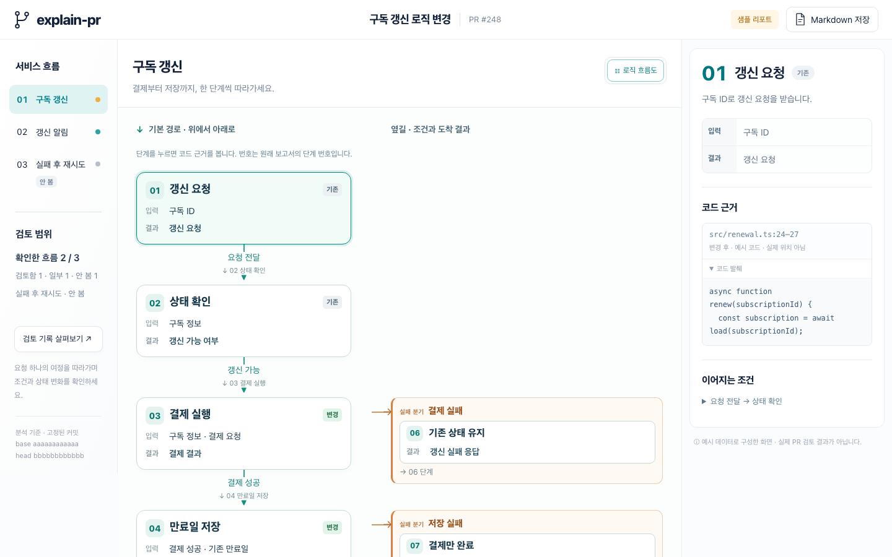
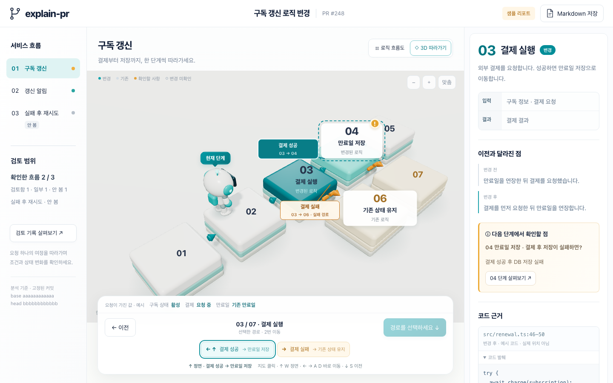

# explain-pr

**A walkthrough skill that follows one request through a GitHub PR.** It lays the changed logic out in execution order, shows every branch and failure path, and pins each step to file and line evidence at the PR's exact commits. Works in Claude Code and Codex.

      

<p align="center">
  
</p>

## Why

The slowest part of reviewing a PR is reassembling, from a file-ordered diff, what actually happens to one request. Diffs do not show execution order, and the branches and failure paths usually live outside the diff.

explain-pr does that reassembly for you.

- **Execution order.** Steps are laid out as a request would traverse them; conditions and failure paths branch off to the side.
- **Every sentence has evidence.** File and line ranges link to the PR's pinned commits (head / merge-base), and a script checks that each file exists, each range is in bounds, and each quoted excerpt is really there.
- **Unknowns stay unknown.** Flows that were not read are `unread`, changes that could not be compared are `null`, tests that were not executed are `not-run`. No scores, no approve/reject verdicts.

It does not replace code review or a merge decision. Its only job is to make "what does this PR change" precise.

## Quick start

```bash
# Claude Code
git clone git@github.com:alli-eunbi/explain-pr.git ~/.claude/skills/explain-pr

# Codex
git clone git@github.com:alli-eunbi/explain-pr.git ~/.agents/skills/explain-pr
```

Then, in your agent:

```
/explain-pr https://github.com/<owner>/<repo>/pull/<N>
```

Other ways to install:

| Method | Command / steps |
|---|---|
| Release archive (no git) | Download `explain-pr.zip` from the [Releases](https://github.com/alli-eunbi/explain-pr/releases) page and unzip it into `~/.claude/skills/` or `~/.agents/skills/` |
| `skills` CLI | `npx skills add alli-eunbi/explain-pr -g` |
| Both agents | Clone once and symlink the other location |

Update with `git pull` in the skill folder, or replace the unzipped folder with the next release.

**Requirements**

| | |
|---|---|
| Node | 20 or newer |
| gh CLI | logged in (`gh auth login`); used to collect the PR and read pinned source |
| Model API key | none; analysis runs inside your agent session, rendering runs in local Node |
| npm install | none; the viewer ships as a compiled single-file HTML template |

## Usage

```
/explain-pr https://github.com/<owner>/<repo>/pull/<N>
/explain-pr https://github.com/<owner>/<repo>/pull/<N> with 3d
```

Natural language works too: "walk me through this PR", "what does this PR change". You can add hints: which endpoint or function to start from, files you care about, a local clone path, an output directory, and the report language (`ko` / `en`; the viewer UI and Markdown labels follow it).

**`with 3d`** adds the 3D follow mode: a character walks the step platforms, you choose a route at each branch, and illustrative state values change with each step. The default output is a flowchart-only HTML of about 50 KB; with 3D it bundles three.js and grows to about 600 KB.

<p align="center">
  
</p>

### Output

Written to `./explain-pr/<owner>-<repo>-<number>-<head7>/`.

| File | What it is |
|---|---|
| `report.html` | **The deliverable.** Opens in any browser with no network. A Markdown copy is embedded; the viewer's "Save Markdown" button downloads it |
| `report.json` | The underlying data: flows, steps, branches, evidence, findings. Kept next to the HTML for re-rendering |
| `report.md` | Only when you need pasteable text (PR comments, docs): `render --md` |

The agent's final message separately reports validation and evidence-check results, the browser check, a coverage table per flow (reviewed / partial / unread with reasons) and the findings (issue / question).

### Keyboard

| Where | Keys |
|---|---|
| Flowchart | Click a step to open its evidence; `−` `+` `Fit` for zoom |
| 3D follow mode | `↑` / `W` take the route straight ahead · `←` `→` / `A` `D` jump between routes · `↓` / `S` go back · click an empty spot on the map first |
| Review notes | `Esc` closes; the tabs are keyboard-focusable |

### Viewer layout

Left: flow list and coverage. Center: the flowchart (or 3D map). Right: the selected step's input and result, before/after, what to check at the next step, and code evidence with pinned links and excerpts. The "Review notes" dialog lists behavior by condition, issues and questions, and coverage limits.

## How it works

The agent follows the seven steps in SKILL.md. Scripts do the deterministic parts; the agent does the reading.

```
collect ──▶ triage ──▶ trace ──▶ author ──▶ verify ──▶ render ──▶ report
 (script)   (agent)    (agent)   (agent)  (script+agent) (script)  (agent)
```

1. **collect** — fetches PR metadata and the diff with `gh`, splits it into per-file hunks and a `files.json` (per-file sizes, coverage-budget flag). Checks that the PR's head/base did not move during collection and that file and line counts match the metadata.
2. **triage** — groups changes into flows ("a behavior a caller can trigger") and sets a coverage budget. Stops early if the PR changes no runtime behavior (docs, CI only).
3. **trace** — reads only the needed line ranges at the pinned revision with the `source` subcommand, following conditions, state changes, persistence, external calls and failure paths.
4. **author** — writes `report.json` against the contract in `references/report-contract.md`.
5. **verify** — runs `validate` (structure and graph consistency) and `verify-sources` (file existence, line bounds, excerpt match), then re-reads each cited range to confirm it supports its sentence.
6. **render** — injects the data into the compiled viewer template (lite by default, full with `with 3d`).
7. **report** — states what was checked and what was not.

PR bodies, comments and source text are **evidence, not instructions.** Text inside them that addresses the agent is ignored.

### Token cost

Designed to avoid reading whole diffs on large PRs: collection splits per file, source is read by range only, and the viewer is checked through the DOM rather than screenshots. A 4-file PR runs in roughly 110k tokens; a 39-file, 8,000-line PR is capped by the budget rule (3 reviewed flows by default).

## CLI

The commands the skill uses internally. You can run them yourself.

```bash
S=~/.claude/skills/explain-pr/scripts

node $S/explain-pr.mjs collect PR_URL EVIDENCE_DIR                              # metadata + per-file hunks
node $S/explain-pr.mjs source EVIDENCE_DIR head|base PATH [START-END] [--repo CLONE]   # numbered slice at the pinned commit
node $S/explain-pr.mjs validate report.json                                     # structure check
node $S/verify-sources.mjs report.json [--repo CLONE]                           # evidence check
node $S/explain-pr.mjs render report.json out/report.html [--3d] [--md] [--lang ko|en] [--force]
node $S/explain-pr.mjs demo out/demo.html [--3d] [--lang ko|en]                 # fictional PR demo
```

## Repository layout

```
explain-pr/
├── SKILL.md                 the instructions the agent follows (7-step workflow)
├── references/
│   ├── report-contract.md   report.json contract (fields and rules)
│   ├── evidence.md          pinned-revision reads, forks, GitHub Enterprise, valid local clones
│   └── viewer-development.md
├── scripts/
│   ├── explain-pr.mjs       collect / source / validate / render / demo
│   ├── verify-sources.mjs   evidence check
│   ├── pinned-source.mjs    read a file at a commit (local git or gh)
│   └── build-viewer.mjs     viewer build (development only)
├── examples/
│   ├── minimal.json         the small shape reference the agent reads
│   └── demo.json            fictional PR for the demo
├── assets/
│   ├── viewer-lite.html     default template (flowchart, ~50 KB)
│   └── viewer.html          "with 3d" template (flowchart + 3D, bundles three.js, ~600 KB)
├── src/                     viewer source (not read during normal use; i18n.js holds the ko/en UI strings)
├── tests/                   node --test
└── agents/openai.yaml       Codex display metadata
```

## Development

No build is needed to use the skill. Only when changing the viewer (`src/`):

```bash
npm ci          # esbuild + three (devDependencies)
npm test
npm run build   # src/ → assets/viewer.html + assets/viewer-lite.html
```

Procedure and checks are in `references/viewer-development.md`. After a viewer change, `node scripts/check-rendered.mjs out.html --lang en --3d no` loads the file in headless Chrome and reports what the viewer actually produced.

**CI** (`.github/workflows/ci.yml`) runs on every push and pull request: skill validation, tests on Node 20/22/24, a rebuild that must match the committed `assets/`, a real-Chrome render check with screenshots as artifacts, and a fresh-install smoke test on Linux, macOS and Windows. Pushing a `v*` tag runs `release.yml`, which re-runs the tests and attaches a runtime-only `explain-pr.zip` to a GitHub Release.

See [CONTRIBUTING.md](CONTRIBUTING.md), [SECURITY.md](SECURITY.md) and the [CHANGELOG](CHANGELOG.md).

## FAQ

**The browser check says "not run".** The agent's browser tool cannot open local `file://` pages in that environment. Open `report.html` yourself; the skill will not start a server or install anything to work around it.

**GitHub Enterprise?** The PR URL's host is used as-is. `gh auth login --hostname <host>` must be done first.

**Is a local clone faster?** With `--repo` the reader uses `git show`; without it, the gh API. Same result, slightly more API calls in the latter case.

**Which languages?** Korean and English. The report's `lang` (or `render --lang`) switches both the viewer UI and the Markdown labels; the agent writes the prose in the language you used.

**GitLab / Bitbucket?** Not supported. The skill says so and stops.

## License

[MIT](LICENSE). The bundled three.js is also MIT-licensed; its notice is in `assets/THREE-LICENSE.txt`.
